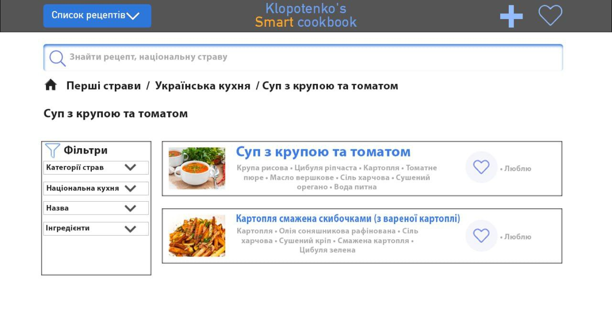
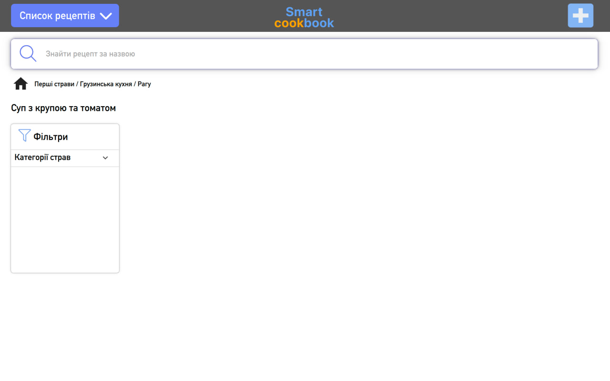
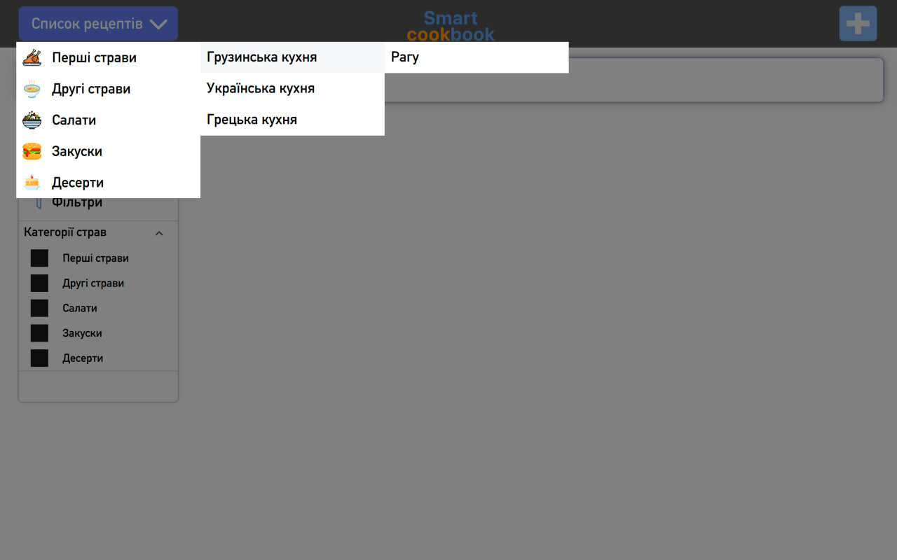

## Klopotenko's Cookbook

**Klopotenko's Cookbook** is a cross-platform client-server application built using **C++**, **Qt**, **MySQL** and **QML** for the GUI, compatible with **macOS**, **Windows** and **Linux**.

**Initial design:**

**Current design:**

**Dropdown button:**

### Key Features:

- **Recipe Browsing**: Users can view all categories, nationalities and general names via cascading dropdown menu.

- **Search**: A search bar allows users to find specific recipes by name.

- **Breadcrumb Navigation**: A breadcrumb navigation bar helps users track their current page and selected recipe, making it easy to navigate back through categories, nationalities, and dishes.

- **Filters**: Filter recipes by:
  - Dish category (e.g., first course, dessert)
  - National cuisine
  - Keywords (e.g., soup, salad)
  - Ingredients

- **Favorites**: Easily mark recipes as favorites by clicking the "heart" icon on the main page.

- **Detailed Recipe View**: Clicking on a recipe opens a detailed page with:
  - Cooking instructions
  - Meal’s output in grams, calories, and number of servings
  - Ability to recalculate these values based on a custom number of servings.

- **Edit and Delete**: Each recipe page includes options to edit or delete the recipe.

This app provides an intuitive and user-friendly way to manage, search, and customize recipes.

## Project File Structure

/Cookbook

│ ├── main.cpp # Main file to launch the application

├──────── /client # Code for the client-side

│ ├────── /src # Client source files

│ ├ client.cpp # Logic for client operations

│ ├── network_client.cpp # Logic for server interaction

│ ├── json_parser.cpp # Logic for JSON handling

│ ├──────/qml_handling # QML interaction logic source files

│ ├── dropdown_recipe_list.cpp   # Dropdown list logic

│ ├── breadcrumb_line.cpp        # Breadcrumb navigation logic

│ └────── /include # Client header files

│ ├── client.h # Header file for the client

│ ├── network_client.h # Header file for network functions

│ ├── json_parser.h # Header file for the JSON parser

│ ├──────/qml_handling # QML interaction logic header files

│ ├── dropdown_recipe_list.h   # Dropdown list logic header file

│ ├── breadcrumb_line.h        # Breadcrumb navigation logic header file

│
├──────── /server # Code for the server-side

│ ├────── /src # Server source files

│ ├── server.cpp # Main server logic

│ ├── server_json_parser.cpp # Logic for parsing client requests

│ ├── database_handler.cpp # Logic for database operations

│ └────── /include # Server header files

│ ├── server.h # Header file for the server

│ ├── server_json_parser.h # Header file for parsing client requests

│ ├── database_handler.h # Header file for database operations
